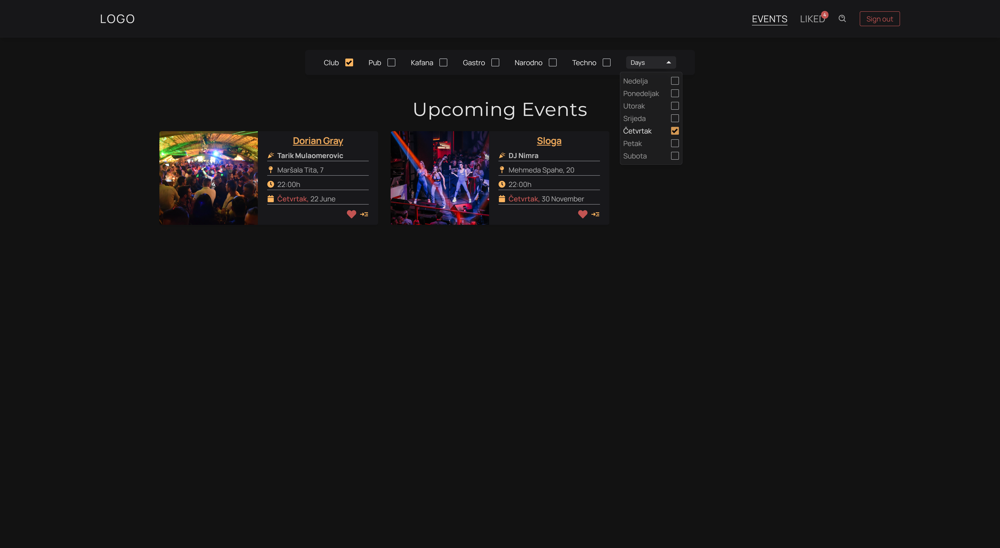
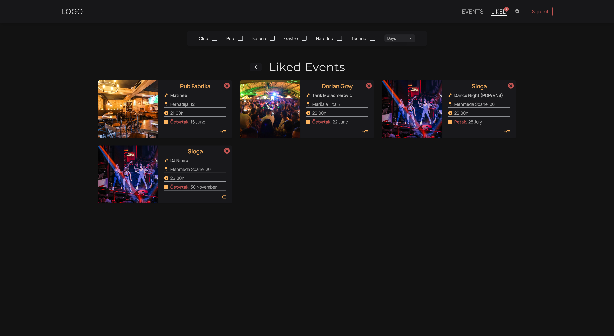
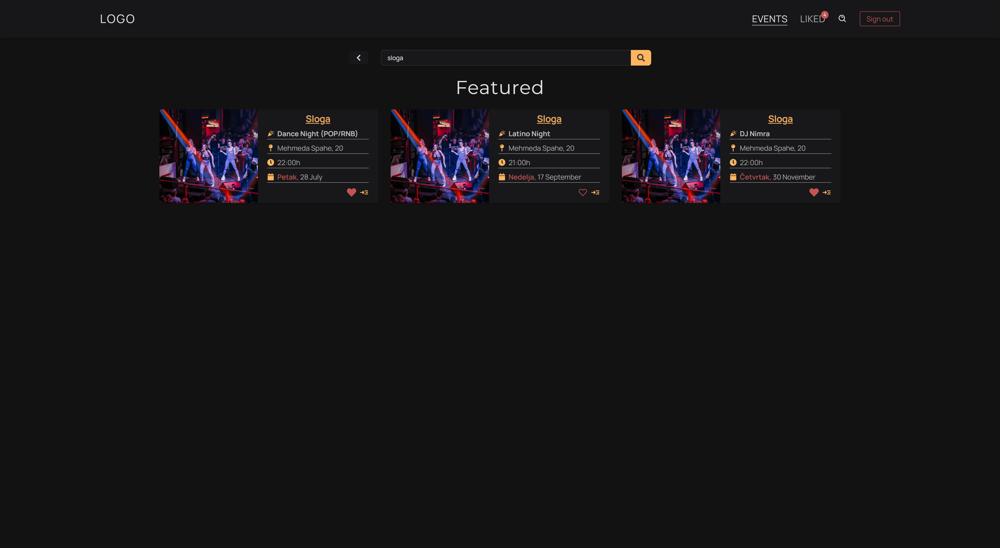
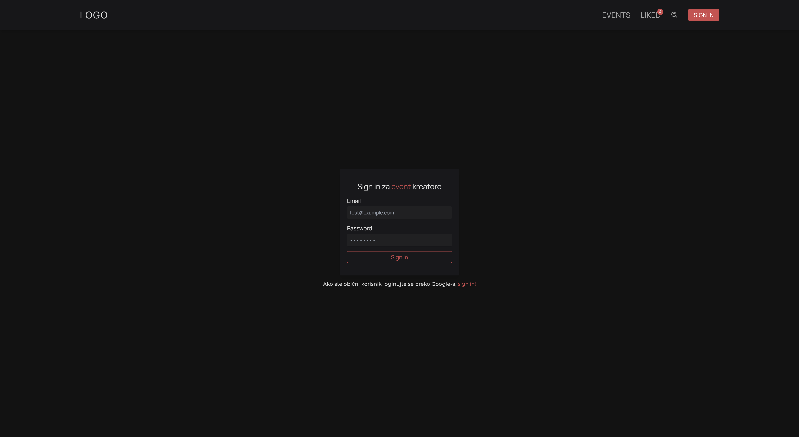

# Sarajevo Večeras Event Tracker Web Application

Event tracking web application for Sarajevo. Built using ReactJS.

Sarajevo Event Tracker is a web application built using ReactJS that serves as your ultimate guide to the party scene in Sarajevo. Whether you're into clubbing, live performances, or DJ sets, this app will keep you informed about the hottest events in the city.

## Features
Browse through a curated list of parties, live performances, and club events happening in Sarajevo.
Detailed event view allows users to access event-specific information, including date, venue, and description.
User authentication powered by Google Authorization ensures secure access to the app.
Logged-in users can save their favorite events to their liked events list for future reference.
Event creators have their own dashboard to create, delete, and edit event details effortlessly.
## Tech Stack
<b>Frontend:</b> ReactJS, Tailwind  
<b>Backend:</b> Firebase Realtime Database, Firestore  
<b>Authentication:</b> Google Authorization  

## Usage
Users can browse events without logging in. To like events and save them to their liked events list, they need to log in using their Google account. 
Event creators can log in and access their dashboard by clicking on the "Create Event" button, where they can add new events, delete existing ones, and edit event details.

